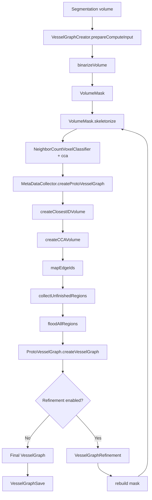

# Vessel Graph Generation Pipeline (Voreen)

## Overview

Voreen does follow the general pattern `segmentation mask -> skeleton -> graph`, but the full implementation is larger than that:

- it first binarizes the input volume into its own working format
- it turns the skeleton into an intermediate `ProtoVesselGraph`, not directly into the final graph
- it assigns original segmentation voxels back to graph edges so the final graph carries measurements
- it can run a refinement loop that rebuilds the graph from a refined mask

The main implementation lives in the `vesselnetworkanalysis` module. The standard extraction workspace in `voreen/modules/vesselnetworkanalysis/test/graph_extraction.vws` uses `VolumeSource -> VesselGraphCreator -> VesselGraphSave`. This extraction pipeline is also the subject of a project paper describing scalable graph and feature extraction for large vessel volumes (Drees et al., 2021).

## Hierarchical Workflow

### High-level hierarchy

1. Read a segmentation volume.
2. Binarize it into Voreen’s slice-based working format.
3. Build a `VolumeMask`.
4. Skeletonize the mask.
5. Convert the skeleton into a proto-graph.
6. Reassign segmentation voxels to graph edges.
7. Build the final `VesselGraph` with measurements.
8. Optionally refine and rebuild the graph.
9. Save the final graph.

### Actual workflow in code

1. Input preparation
   - Read the input segmentation, optional sample mask, and optional fixed foreground points.
   - Normalize the user threshold into the input volume’s value range.
2. Mask stage
   - Binarize the segmentation into a temporary `LZ4SliceVolume<uint8_t>`.
   - Build a `VolumeMask` from that binary data.
   - Mark outside-mask voxels and protected fixed points when those inputs exist.
3. Skeleton stage
   - Call `VolumeMask::skeletonize(...)` to thin the mask to a 1-voxel skeleton.
4. Skeleton-to-graph stage
   - Stream over the skeleton with `NeighborCountVoxelClassifier`.
   - Group voxels into **end**, **regular**, and **branch** classes.
   - Convert those groups into a `ProtoVesselGraph`.
5. Segmentation reassignment stage
   - Map segmentation voxels to the nearest proto-edge voxels.
   - Run connected-component labeling and edge-id remapping.
   - Flood unresolved regions that were cut off during earlier steps.
6. Final graph build stage
   - Convert the proto-graph plus the labeled segmentation volume into a full `VesselGraph`.
   - Compute edge and node features from the segmentation-supported geometry.
7. Optional refinement stage
   - Remove weak end branches.
   - Rebuild a mask from the refined graph.
   - Skeletonize again and recreate the graph.
8. Output stage
   - Publish the graph to the outport.
   - Save it as `.vvg`, `.vvg.gz`, or `.obj`.

## Mermaid Flowchart

## Stage-By-Stage Algorithm Summary

- Segmentation mask stage: present

  - Voreen starts from a segmentation volume, then binarizes it into a temporary `LZ4SliceVolume<uint8_t>` and wraps that data in a `VolumeMask`.
  - The code also supports an optional sample mask and optional fixed foreground points.
  - Files/functions:
    - `processors/vesselgraphcreator.cpp::VesselGraphCreator::prepareComputeInput`
    - `modules/bigdataimageprocessing/datastructures/lz4slicevolume.cpp::binarizeVolume`
    - `algorithm/volumemask.h` and `algorithm/volumemask.cpp`
- Skeletonize mask stage: present

  - `VolumeMask::skeletonize(...)` performs the thinning step.
  - The code explicitly uses the `IMPROVED` mode for the first graph and `IMPROVED_NO_LINE_PRESERVATION` during refinement iterations.
  - Files/functions:
    - `algorithm/volumemask.h::VolumeMask::skeletonize`
    - `processors/vesselgraphcreator.cpp::createInitialVesselGraph`
    - `processors/vesselgraphcreator.cpp::refineVesselGraph`
- Convert skeleton into graph stage: present

  - Voreen does not convert the skeleton directly into the final graph.
  - It first classifies skeleton voxels by neighbor count, groups them with streaming connected-component analysis, and builds a `ProtoVesselGraph`.
  - Files/functions:
    - `algorithm/streaminggraphcreation.h/.cpp::NeighborCountVoxelClassifier`
    - `algorithm/streaminggraphcreation.cpp::MetaDataCollector::createProtoVesselGraph`
    - `processors/vesselgraphcreator.cpp::createGraphFromMask`

  **Note**:

  - Voxel classification is local. For each skeleton voxel, the code looks at the full `3x3x3` neighborhood around it. After excluding the voxel itself, this is the 26-neighborhood. If the voxel has fewer than two skeleton neighbors, it is an **end voxel**. If it has exactly two skeleton neighbors, it is a **regular voxel**. If it has more than two skeleton neighbors, it is a **branch voxel**. In plain English: a dead-end point becomes an endpoint, a point in the middle of a line becomes a regular vessel segment voxel, and a point where several lines meet becomes part of a junction.
  - The classified voxels are then grouped before graph creation. The code scans rows and stores consecutive voxels of the same class as `runs`. A run is like highlighting one continuous word in a line of text instead of marking every letter separately. Connected-component analysis then connects touching runs across neighboring rows and slices. This turns many tiny voxel labels into larger meaningful pieces: endpoint components, regular centerline components, and branch/junction components.
  - The proto-graph is built from those connected pieces. Endpoint components and branch components become proto-graph nodes. Regular components become proto-graph edges between nearby nodes. A useful analogy is a subway map: individual skeleton voxels are like painted pixels on the map, runs are short strokes of the same color, connected components are whole track segments or station blobs, and the proto-graph is the simplified map with stations as nodes and tracks as edges.
- Extra stage after skeleton-to-graph: assign segmentation voxels back to edges

  - This is a major extra stage in Voreen.
  - The code maps foreground segmentation voxels to nearby proto-edge voxels, runs connected-component analysis, remaps temporary labels to real edge ids, and floods unfinished regions.
  - **This stage is what lets the final graph carry thickness and shape measurements** from the original segmentation instead of only topology from the skeleton.
  - Files/functions:
    - `processors/vesselgraphcreator.cpp::createClosestIDVolume`
    - `processors/vesselgraphcreator.cpp::createCCAVolume`
    - `processors/vesselgraphcreator.cpp::mapEdgeIds`
    - `processors/vesselgraphcreator.cpp::collectUnfinishedRegions`
    - `processors/vesselgraphcreator.cpp::UnfinishedRegions::floodAllRegions`
- Extra stage after reassignment: build final graph with measurements

  - The final `VesselGraph` is created from the proto-graph plus the labeled segmentation volume.
  - This stage computes the final edge and node measurements. The code clearly does this, even though the exact formulas for every measurement are spread across the graph data structure code.
  - Files/functions:
    - `datastructures/protovesselgraph.cpp::ProtoVesselGraph::createVesselGraph`
    - `datastructures/vesselgraph.h`
    - `datastructures/vesselgraph.cpp`
- Extra stage after graph creation: refinement loop

  - Voreen can prune weak end branches and then rebuild the graph from a new mask.
  - This is not just a small cleanup pass; it re-enters the skeletonization and graph creation path.
  - Files/functions:
    - `processors/vesselgraphcreator.cpp::refineVesselGraph`
    - `processors/vesselgraphcreator.cpp::iterationMadeProgress`
    - `algorithm/vesselgraphrefinement.cpp`

## Notes On Extra Stages And Deviations

- Voreen does match the 3-stage pattern overall, but the real implementation is `mask -> skeleton -> proto-graph -> segmentation-supported final graph`.
- The proto-graph stage is an important internal step and should not be skipped when reading the code.
- The segmentation-to-edge reassignment stage is also essential because the final graph is feature-rich, not just topological.
- Refinement is iterative and rebuilds the graph, rather than only editing the final graph in place.

## Implementations and Branches

### 1. Main extraction path

File: `voreen/modules/vesselnetworkanalysis/processors/vesselgraphcreator.cpp`

- This is the main segmentation-to-graph implementation.
- It does its own binarization and skeletonization internally.
- This is the path used by `graph_extraction.vws`.

### 2. Standalone thinning path

Files:

- `voreen/modules/vesselnetworkanalysis/processors/volumethinning.cpp`
- `voreen/modules/vesselnetworkanalysis/algorithm/volumemask.*`

This processor only skeletonizes a binary volume and outputs the skeleton volume. It is related to graph generation because it uses the same thinning machinery, but it does not itself build a `VesselGraph`.

### 3. Separate post-hoc refinement path

Files:

- `voreen/modules/vesselnetworkanalysis/processors/vesselgraphrefiner.cpp`
- `voreen/modules/vesselnetworkanalysis/algorithm/vesselgraphrefinement.*`

This path refines an already-built graph. It is not the normal end-to-end extraction path, but it uses the same edge-removal logic that `VesselGraphCreator` uses during iterative refinement.

## Exact Files Involved

| File                                                                          | Responsibility                                                               |
| ----------------------------------------------------------------------------- | ---------------------------------------------------------------------------- |
| `Readme.md`                                                                 | High-level project context.                                                  |
| `voreen/modules/vesselnetworkanalysis/test/graph_extraction.vws`            | Example workspace showing the standard extraction chain.                     |
| `voreen/modules/vesselnetworkanalysis/vesselnetworkanalysismodule.cpp`      | Registers graph-related processors.                                          |
| `voreen/modules/vesselnetworkanalysis/processors/vesselgraphcreator.h`      | Declares the main graph extraction processor and its inputs/outputs.         |
| `voreen/modules/vesselnetworkanalysis/processors/vesselgraphcreator.cpp`    | Main segmentation-to-graph implementation.                                   |
| `voreen/modules/vesselnetworkanalysis/algorithm/volumemask.h`               | Declares the binary mask and thinning logic.                                 |
| `voreen/modules/vesselnetworkanalysis/algorithm/volumemask.cpp`             | Implements mask storage and thinning helpers.                                |
| `voreen/modules/vesselnetworkanalysis/algorithm/streaminggraphcreation.h`   | Declares skeleton classification and streaming proto-graph extraction types. |
| `voreen/modules/vesselnetworkanalysis/algorithm/streaminggraphcreation.cpp` | Builds the proto-graph from the skeleton.                                    |
| `voreen/modules/vesselnetworkanalysis/datastructures/protovesselgraph.h`    | Declares the intermediate proto-graph data structure.                        |
| `voreen/modules/vesselnetworkanalysis/datastructures/protovesselgraph.cpp`  | Converts the proto-graph plus labeled volume into the final `VesselGraph`. |
| `voreen/modules/vesselnetworkanalysis/datastructures/vesselgraph.h`         | Declares the final graph data structures and edge/node feature types.        |
| `voreen/modules/vesselnetworkanalysis/datastructures/vesselgraph.cpp`       | Implements graph/node/edge behavior and JSON serialization helpers.          |
| `voreen/modules/vesselnetworkanalysis/algorithm/vesselgraphrefinement.h`    | Declares graph refinement helpers.                                           |
| `voreen/modules/vesselnetworkanalysis/algorithm/vesselgraphrefinement.cpp`  | Implements edge-removal and degree-2-node cleanup.                           |
| `voreen/modules/vesselnetworkanalysis/processors/vesselgraphrefiner.h`      | Declares the standalone refiner processor.                                   |
| `voreen/modules/vesselnetworkanalysis/processors/vesselgraphrefiner.cpp`    | Wraps refinement as a processor.                                             |
| `voreen/modules/vesselnetworkanalysis/processors/vesselgraphsave.h`         | Declares the graph save/export processor.                                    |
| `voreen/modules/vesselnetworkanalysis/processors/vesselgraphsave.cpp`       | Saves graphs as `.vvg`, `.vvg.gz`, or `.obj`.                          |
| `voreen/modules/vesselnetworkanalysis/processors/volumethinning.h`          | Declares the standalone thinning processor.                                  |
| `voreen/modules/vesselnetworkanalysis/processors/volumethinning.cpp`        | Skeletonizes a binary volume without building a graph.                       |
| `voreen/modules/bigdataimageprocessing/datastructures/lz4slicevolume.h`     | Declares `binarizeVolume` and the temporary slice-volume format.           |
| `voreen/modules/bigdataimageprocessing/datastructures/lz4slicevolume.cpp`   | Implements `binarizeVolume`.                                               |

## Exact Functions and Classes Involved

### Main processor path

| Function / class                                | File                                  | Responsibility                                                                         |
| ----------------------------------------------- | ------------------------------------- | -------------------------------------------------------------------------------------- |
| `VesselGraphCreator`                          | `processors/vesselgraphcreator.h`   | Main processor that extracts a graph from a segmentation.                              |
| `VesselGraphCreatorInput`                     | `processors/vesselgraphcreator.h`   | Immutable compute input payload for extraction.                                        |
| `VesselGraphCreatorOutput`                    | `processors/vesselgraphcreator.h`   | Compute output containing the graph and optional debug artifacts.                      |
| `VesselGraphCreator::prepareComputeInput`     | `processors/vesselgraphcreator.cpp` | Reads ports, extracts fixed points, normalizes thresholds, and prepares compute input. |
| `VesselGraphCreator::compute`                 | `processors/vesselgraphcreator.cpp` | Runs initial extraction and optional refinement iterations.                            |
| `VesselGraphCreator::processComputeOutput`    | `processors/vesselgraphcreator.cpp` | Publishes the graph and debug outputs to outports.                                     |
| `VesselGraphCreator::adjustPropertiesToInput` | `processors/vesselgraphcreator.cpp` | Adapts the threshold property to the input volume range.                               |
| `createInitialVesselGraph`                    | `processors/vesselgraphcreator.cpp` | Creates the first graph from the binarized segmentation.                               |
| `refineVesselGraph`                           | `processors/vesselgraphcreator.cpp` | Runs one refinement iteration by pruning and rebuilding the graph.                     |
| `createGraphFromMask`                         | `processors/vesselgraphcreator.cpp` | Converts a skeleton mask into a final `VesselGraph`.                                 |
| `iterationMadeProgress`                       | `processors/vesselgraphcreator.cpp` | Stops refinement when the graph no longer changes.                                     |
| `tryExtractPoints`                            | `processors/vesselgraphcreator.cpp` | Reads optional fixed foreground seed points from input geometry.                       |
| `addFixedForegroundPointsToMask`              | `processors/vesselgraphcreator.cpp` | Marks protected points before thinning.                                                |
| `fixEndVoxelsInMask`                          | `processors/vesselgraphcreator.cpp` | Protects refined graph endpoints before re-thinning.                                   |

### Input binarization and working mask

| Function / class                      | File                                                                 | Responsibility                                                            |
| ------------------------------------- | -------------------------------------------------------------------- | ------------------------------------------------------------------------- |
| `binarizeVolume`                    | `modules/bigdataimageprocessing/datastructures/lz4slicevolume.cpp` | Converts a volume into a temporary binary slice volume on disk.           |
| `VolumeMask`                        | `algorithm/volumemask.h`                                           | Compact binary mask used for skeletonization and later rebuilding.        |
| `VolumeMask::VolumeMask`            | `algorithm/volumemask.cpp`                                         | Builds the mask from the binarized segmentation and optional sample mask. |
| `VolumeMask::set`                   | `algorithm/volumemask.cpp`                                         | Writes a voxel value into the mask.                                       |
| `VolumeMask::get`                   | `algorithm/volumemask.cpp`                                         | Reads a voxel value with special handling for outside-volume voxels.      |
| `VolumeMask::skeletonize`           | `algorithm/volumemask.h`                                           | Main thinning entry point.                                                |
| `VolumeMask::scrape`                | `algorithm/volumemask.h`                                           | Improved iterative scraping-based thinning.                               |
| `VolumeMask::thinnerByLee`          | `algorithm/volumemask.h`                                           | Lee-style directional thinning path.                                      |
| `VolumeMaskStorage`                 | `algorithm/volumemask.h`                                           | Low-level 2-bit-per-voxel storage backend for the mask.                   |
| `VolumeMaskStorage::set`            | `algorithm/volumemask.cpp`                                         | Stores a packed voxel value.                                              |
| `VolumeMaskStorage::get`            | `algorithm/volumemask.cpp`                                         | Reads a packed voxel value.                                               |
| `ScrapeIterationDescriptor`         | `algorithm/volumemask.h`                                           | Describes one directional scrape pass.                                    |
| `LinePreservingScraping`            | `algorithm/volumemask.h`                                           | Policy used by thinning variants that preserve lines.                     |
| `NoLinePreservingScraping`          | `algorithm/volumemask.h`                                           | Policy used by thinning variants that allow more aggressive deletion.     |
| `ScrapeIterationCoordinator`        | `algorithm/volumemask.h`                                           | Coordinates scrape pass order and termination.                            |
| `VolumeMask::isSurfaceVoxel`        | `algorithm/volumemask.cpp`                                         | Tests whether a voxel is on the object surface.                           |
| `VolumeMask::isEndVoxel`            | `algorithm/volumemask.cpp`                                         | Tests whether a voxel behaves like an endpoint.                           |
| `VolumeMask::isSimple`              | `algorithm/volumemask.cpp`                                         | Tests whether a voxel can be removed without changing topology.           |
| `VolumeMask::isEulerInvariantVoxel` | `algorithm/volumemask.cpp`                                         | Euler-based topology preservation test.                                   |

### Skeleton classification and proto-graph extraction

| Function / class                                               | File                                        | Responsibility                                                        |
| -------------------------------------------------------------- | ------------------------------------------- | --------------------------------------------------------------------- |
| `cca`                                                        | `algorithm/streaminggraphcreation.h`      | Streaming connected-component-style scan over skeleton voxel classes. |
| `SkeletonClassReader`                                        | `algorithm/streaminggraphcreation.h/.cpp` | Reads the skeleton and classifies voxels by neighbor count.           |
| `NeighborCountVoxelClassifier`                               | `algorithm/streaminggraphcreation.h/.cpp` | Standard skeleton voxel classifier for graph extraction.              |
| `RunPosition`                                                | `algorithm/streaminggraphcreation.h/.cpp` | Stores a horizontal run of same-class voxels.                         |
| `RunTree`, `RunNode`, `RunLeaf`                          | `algorithm/streaminggraphcreation.h/.cpp` | Store and merge ordered voxel runs for regular and branch structures. |
| `EndData`                                                    | `algorithm/streaminggraphcreation.h/.cpp` | Metadata for end-voxel components.                                    |
| `RegularData`                                                | `algorithm/streaminggraphcreation.h/.cpp` | Metadata for regular branch runs.                                     |
| `BranchData`                                                 | `algorithm/streaminggraphcreation.h/.cpp` | Metadata for branch/junction voxel groups.                            |
| `MetaDataCollector`                                          | `algorithm/streaminggraphcreation.h/.cpp` | Collects skeleton component metadata and creates the proto-graph.     |
| `MetaDataCollector::createProtoVesselGraph`                  | `algorithm/streaminggraphcreation.cpp`    | Builds proto nodes and proto edges from collected skeleton groups.    |
| `Row`, `RowStorage`, `Node`, `Run`, `RunComposition` | `algorithm/streaminggraphcreation.h/.cpp` | Internal streaming structures used to merge voxel runs across slices. |

### Proto-graph to final graph

| Function / class                                | File                                       | Responsibility                                                           |
| ----------------------------------------------- | ------------------------------------------ | ------------------------------------------------------------------------ |
| `ProtoVesselGraph`                            | `datastructures/protovesselgraph.h`      | Intermediate graph built directly from the skeleton.                     |
| `ProtoVesselGraphNode`                        | `datastructures/protovesselgraph.h/.cpp` | Proto node with voxel support and border flag.                           |
| `ProtoVesselGraphEdge`                        | `datastructures/protovesselgraph.h/.cpp` | Proto edge with original and smoothed centerline voxels.                 |
| `ProtoVesselGraph::insertNode`                | `datastructures/protovesselgraph.cpp`    | Adds a proto node.                                                       |
| `ProtoVesselGraph::insertEdge`                | `datastructures/protovesselgraph.cpp`    | Adds a proto edge.                                                       |
| `ProtoVesselGraph::createVesselGraph`         | `datastructures/protovesselgraph.cpp`    | Converts the proto-graph into the final feature-annotated graph.         |
| `ProtoVesselGraphEdge::findClosestVoxelIndex` | `datastructures/protovesselgraph.cpp`    | Finds nearest centerline voxels for assigning segmentation measurements. |
| `createClosestIDVolume`                       | `processors/vesselgraphcreator.cpp`      | Assigns each segmentation voxel to its nearest proto-edge.               |
| `createCCAVolume`                             | `processors/vesselgraphcreator.cpp`      | Separates connected foreground regions in the nearest-edge ID volume.    |
| `mapEdgeIds`                                  | `processors/vesselgraphcreator.cpp`      | Replaces component IDs with actual edge IDs.                             |
| `collectUnfinishedRegions`                    | `processors/vesselgraphcreator.cpp`      | Finds unlabeled foreground regions that still need assignment.           |
| `UnfinishedRegions`                           | `processors/vesselgraphcreator.cpp`      | Holds unlabeled regions and their bounds.                                |
| `UnfinishedRegions::floodAllRegions`          | `processors/vesselgraphcreator.cpp`      | Flood-fills remaining unlabeled regions locally.                         |
| `initializeIdVolumes`                         | `processors/vesselgraphcreator.cpp`      | Builds local per-region ID volumes used for flooding.                    |
| `flood`                                       | `processors/vesselgraphcreator.cpp`      | Executes the region-local label flood.                                   |
| `finalizeIdVolumes`                           | `processors/vesselgraphcreator.cpp`      | Writes flooded IDs back into the edge-ID volume.                         |
| `IdVolumeInitializer`                         | `processors/vesselgraphcreator.cpp`      | Temporary setup for local flooding.                                      |
| `IdVolumeFinalizer`                           | `processors/vesselgraphcreator.cpp`      | Reads flooded local ID volumes back into the global volume.              |

### Final graph and refinement

| Function / class                                     | File                                       | Responsibility                                                         |
| ---------------------------------------------------- | ------------------------------------------ | ---------------------------------------------------------------------- |
| `VesselGraph`                                      | `datastructures/vesselgraph.h/.cpp`      | Final graph data structure used by Voreen.                             |
| `VesselGraphNode`                                  | `datastructures/vesselgraph.h/.cpp`      | Final graph node.                                                      |
| `VesselGraphEdge`                                  | `datastructures/vesselgraph.h/.cpp`      | Final graph edge.                                                      |
| `VesselSkeletonVoxel`                              | `datastructures/vesselgraph.h/.cpp`      | Centerline voxel annotated with surface and volume measurements.       |
| `VesselGraphEdgePathProperties`                    | `datastructures/vesselgraph.h`           | Aggregated edge measurements.                                          |
| `VesselGraphRefinement`                            | `algorithm/vesselgraphrefinement.h/.cpp` | Static helper for pruning and normalizing graphs.                      |
| `VesselGraphRefinement::removeEndEdgesRecursively` | `algorithm/vesselgraphrefinement.cpp`    | Repeatedly removes weak end branches.                                  |
| `VesselGraphRefinement::removeEndEdges`            | `algorithm/vesselgraphrefinement.cpp`    | Removes one round of weak end branches.                                |
| `VesselGraphRefinement::removeAllEdges`            | `algorithm/vesselgraphrefinement.cpp`    | More aggressive optional refinement that can remove central edges too. |
| `VesselGraphRefinement::removeDregree2Nodes`       | `algorithm/vesselgraphrefinement.cpp`    | Simplifies chains after removals by collapsing degree-2 nodes.         |
| `VesselGraphRefiner`                               | `processors/vesselgraphrefiner.h/.cpp`   | Processor wrapper around the refinement helpers.                       |
| `VesselGraphRefiner::process`                      | `processors/vesselgraphrefiner.cpp`      | Applies refinement to an existing graph.                               |
| `VesselGraphRefiner::createRemovableEdgePredicate` | `processors/vesselgraphrefiner.cpp`      | Creates the edge-quality test used by refinement.                      |

### Export

| Function / class                      | File                                  | Responsibility                                       |
| ------------------------------------- | ------------------------------------- | ---------------------------------------------------- |
| `VesselGraphSave`                   | `processors/vesselgraphsave.h/.cpp` | Writes the graph to disk.                            |
| `VesselGraphSave::saveCurrentGraph` | `processors/vesselgraphsave.cpp`    | Saves the current graph according to file extension. |
| `VesselGraphSave::process`          | `processors/vesselgraphsave.cpp`    | Triggers continuous save on input changes.           |
| `saveAsJson`                        | `processors/vesselgraphsave.cpp`    | Writes `.vvg` or `.vvg.gz`.                      |
| `saveAsWavefrontObj`                | `processors/vesselgraphsave.cpp`    | Writes centerline-only `.obj`.                     |

### Related but separate

| Function / class            | File                                 | Responsibility                                                                                        |
| --------------------------- | ------------------------------------ | ----------------------------------------------------------------------------------------------------- |
| `VolumeThinning`          | `processors/volumethinning.h/.cpp` | Standalone skeletonization processor. Useful for inspection, not required by the main graph pipeline. |
| `VolumeThinning::process` | `processors/volumethinning.cpp`    | Binarizes, builds a `VolumeMask`, skeletonizes, and outputs a skeleton volume.                      |

## Important Notes

- The main graph extractor does not require a pre-thinned skeleton volume.
- `VesselGraphCreator` does its own binarization and thinning internally.
- The output graph is not just topology. It also carries geometry and surface-derived measurements gathered from the original segmentation.
- Refinement in `VesselGraphCreator` is iterative and reconstructive: it prunes the graph, rebuilds a mask, re-skeletonizes, and regenerates the graph.

## Assumptions, Edge Cases, and Unclear Areas

- The input is treated as binary by thresholding, not by checking that it already contains only two values. A non-binary volume is still accepted as long as a threshold is provided.
- The optional sample mask is used both during initial mask construction and later when setting node border flags and excluding voxels outside the sample.
- Fixed foreground points are only useful if they can be extracted from supported point-based geometry types. Unsupported geometry is silently ignored by `tryExtractPoints`.
- The refinement loop stops when node count, edge count, and graph bounds stop changing. It does not compare the full graph structure.
- `VesselGraphRefiner` warns in its description that it cannot recompute edge properties after removing edges. The integrated refinement inside `VesselGraphCreator` avoids that limitation by rebuilding the graph from the segmentation after pruning.
- The standalone `VolumeThinning` processor and the integrated thinning inside `VesselGraphCreator` use the same `VolumeMask` machinery, but the creator chooses specific thinning variants for initial extraction versus refinement.
- `graph_extraction.vws` shows multiple `VesselGraphCreator` instances with different refinement settings. Those are separate parameter branches of the same implementation, not different extraction algorithms.

## Verification

This document is based only on inspected repository contents. Every file and function/class named here was inspected before writing this file.

## Related Publications

- The main extraction pipeline implemented in `VesselGraphCreator` is described by the Voreen vessel graph paper (Drees, Scherzinger, Hägerling, Kiefer, & Jiang, 2021).
- That paper is the reliable publication match for the combined method used here: thresholded mask creation, thinning, proto-graph construction, voxel-to-edge reassignment, feature extraction, and iterative refinement.
- No separate publication was identified from the inspected repository contents for the specific thinning mode names used in code (`IMPROVED`, `IMPROVED_NO_LINE_PRESERVATION`), for `NeighborCountVoxelClassifier` as an isolated algorithm outside the project paper, or for the save/export processor format handling.

## Bibliography

Drees, D., Scherzinger, A., Hägerling, R., Kiefer, F., & Jiang, X. (2021). Scalable robust graph and feature extraction for arbitrary vessel networks in large volumetric datasets. *BMC Bioinformatics, 22*, Article 346. https://doi.org/10.1186/s12859-021-04262-w
